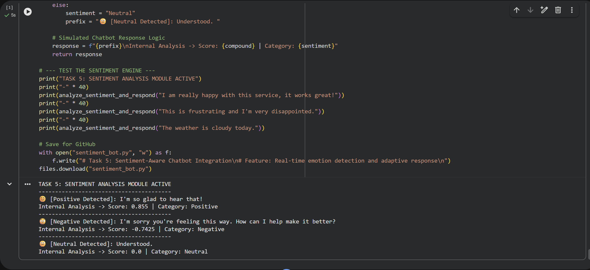

# Task 5: Sentiment-Aware Chatbot Integration

## 📋 Project Overview
This module integrates **Emotional Intelligence** into the chatbot framework. By leveraging **Sentiment Analysis**, the system can now recognize user emotions (Positive, Negative, or Neutral) and adjust its response tone in real-time to enhance the overall customer experience.

## 🧠 Technical Highlights
- **Emotion Recognition:** Powered by the **VADER (Valence Aware Dictionary and sEntiment Reasoner)** model for robust polarity detection.
- **Adaptive Response Logic:** The system uses a conditional branching architecture to prefix responses with empathetic or enthusiastic tones based on the user's "Compound Score."
- **Customer Satisfaction (CSAT) Optimization:** Specifically designed to identify frustrated users and offer specialized assistance, reducing interaction friction.

## 🛠️ Tech Stack
- **Library:** NLTK (Natural Language Toolkit)
- **Engine:** VADER Sentiment Analysis
- **Integration:** Structured for seamless **Streamlit** UI deployment.

## 📊 Result Screenshot

---
*Developed as part of the AI Chatbot Internship - Task 5 Completion.*
